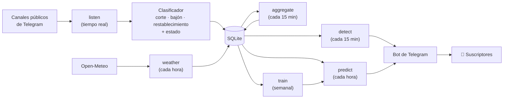

<div align="center">

# ⚡ apagon

**Avisos tempranos de apagones y bajones en Venezuela, hechos con datos abiertos y un bot de Telegram.**

*Desde la diáspora no podemos llevarle una planta eléctrica a nuestra familia. Pero sí podemos avisarle antes de que se vaya la luz.*

</div>

---

## Por qué existe este proyecto

En Venezuela, quedarse sin luz es parte de la rutina. La crisis eléctrica se agravó tras la nacionalización del sector en 2007 y la centralización en Corpoelec. Desde entonces el país ha vivido:

- **2010**: decreto de emergencia eléctrica y racionamientos nacionales.
- **2016**: cortes programados de 4 horas diarias y semanas laborales recortadas en el sector público.
- **Marzo de 2019**: el apagón nacional más largo de la historia del país, con regiones enteras sin servicio durante días.
- **Agosto de 2024**: un nuevo apagón nacional.
- **Todos los días**: racionamientos y bajones, sobre todo en Zulia y los Andes.

Mientras tanto, la información oficial sobre cortes es escasa o llega tarde. Quien vive allá se entera cuando ya está a oscuras.

Un aviso a tiempo cambia mucho:

- cargar el teléfono y las baterías;
- llenar los tanques de agua antes de que se paren las bombas;
- desconectar la nevera y los equipos antes de un bajón que los queme;
- reorganizar el trabajo o las clases.

Más de 7 millones de venezolanos vivimos fuera del país. Este proyecto es nuestra forma de ayudar a los que están allá: con código.

## Qué hace

Un bot de Telegram al que cualquiera puede suscribirse por estado. Envía dos tipos de alerta:

| | Alerta | Cómo se genera |
|---|---|---|
| ⚡ | **Detección**: *"Fallas eléctricas reportadas en Zulia: 5 personas distintas reportaron cortes o bajones en los últimos 60 min."* | Reglas sobre reportes en tiempo real. Funciona desde el primer día. |
| 🔮 | **Pronóstico**: *"Riesgo de falla eléctrica en Zulia: 71% en las próximas 6 h."* | Modelo de machine learning entrenado con el historial de reportes y el clima. |

## Qué buscamos

**Objetivos**

- **Costo casi cero**: corre en una VM gratuita o de ~4 €/mes.
- **Cero hardware**: solo fuentes de software (redes sociales y clima).
- **Honestidad estadística**: el pronóstico solo se activa si le gana a un baseline simple. Si no, el bot solo envía detecciones.
- **Privacidad**: nunca se guarda quién reporta.
- **Fácil de mejorar**: cada pieza es un script pequeño, testeado y reemplazable.

**Lo que no es**

- No es un aviso oficial ni reemplaza la información de la empresa eléctrica.
- No mide la red eléctrica directamente: infiere fallas a partir de lo que la gente reporta.

## Tecnologías

| Etapa | Herramienta | Por qué |
|---|---|---|
| Reportes sociales | [Telethon](https://docs.telethon.dev) | Lee canales públicos de Telegram, incluido su historial: se puede entrenar desde el día 1. |
| Clima | [Open-Meteo](https://open-meteo.com) | Sin API key. Ofrece pronóstico horario y archivo histórico. |
| Clasificación de texto | Regex + gazetteer de ciudades y municipios | Cero cómputo y fácil de auditar. Distingue corte, bajón y restablecimiento. |
| Almacenamiento | SQLite (modo WAL) | Un solo archivo, cero administración. |
| Modelo | XGBoost, frente a persistencia y regresión logística | Liviano, maneja datos faltantes y se entrena en segundos. |
| Orquestación | cron + systemd | Sin colas ni brokers: cuatro jobs y dos servicios. |
| Alertas | python-telegram-bot + Bot API | El canal que ya usa la gente en Venezuela. |
| Infraestructura | Oracle Cloud Always Free o Hetzner CX22 | Gratis o casi. |

## Cómo funciona



1. **Escuchar.** Un proceso lee canales públicos de reportes eléctricos. Cada mensaje se clasifica como corte, bajón o restablecimiento y se ubica en un estado según las ciudades que menciona.
2. **Etiquetar.** Una hora cuenta como "falla" en un estado si al menos 3 personas distintas la reportan. Contar personas distintas filtra el spam y los reenvíos. Los mensajes de "llegó la luz" también cuentan: durante el apagón la gente casi no puede publicar.
3. **Sumar contexto.** El calor dispara la demanda y las tormentas tumban líneas. La lluvia acumulada en la cuenca del Caroní (embalse de Guri, de donde sale la mayor parte de la electricidad del país) mide el estrés de fondo del sistema.
4. **Detectar.** Si una región tiene más reportes de lo normal para esa hora, se alerta de inmediato.
5. **Pronosticar.** Cada hora el modelo estima, para cada estado, la probabilidad de una falla en las próximas 6 horas.
6. **Reentrenar.** Cada semana se reentrena con validación temporal. El pronóstico se apaga solo si deja de superar al baseline.

## Pruébalo en 2 minutos

No hacen falta credenciales: la demo simula 180 días de clima, sequías, racionamientos y mensajes, y los pasa por el mismo pipeline que los datos reales.

```bash
make install   # entorno virtual + dependencias
make demo      # pipeline completo con datos sintéticos
make test      # 19 tests
```

```
modelo           PR-AUC    Brier
persistencia      0.109    0.068
logistica         0.291    0.061
xgboost           0.291    0.061
tasa base: 0.074 · pronóstico habilitado: SÍ · umbral sugerido (máx F1): 0.148

Riesgo de falla en las próximas horas (top 8):
  ZUL   71.4% ██████████████
  MER   19.5% ████
  TAC   18.5% ████
```

> Los números de la demo solo prueban que el pipeline funciona. **No dicen nada del rendimiento con datos reales.** La demo usa `data/demo.db` y nunca toca la base real.

## Ponerlo en producción

1. **Servidor.** Crea una VM Ubuntu, clona el repo en `/opt/apagon` y corre `sudo bash deploy/setup.sh`.
2. **Credenciales.** Edita `.env` (la plantilla está en `.env.example`):
   - `TELEGRAM_API_ID` y `TELEGRAM_API_HASH`, de [my.telegram.org](https://my.telegram.org). Usa una cuenta **dedicada** al proyecto: un bot no puede leer canales ajenos, así que la lectura necesita una cuenta de usuario.
   - `TELEGRAM_BOT_TOKEN`, de [@BotFather](https://t.me/BotFather), y `APAGON_DRY_RUN=0`.
   - `APAGON_AUTHOR_SALT`: una cadena aleatoria y privada.
3. **Canales.** Agrega canales de reportes en `config/channels.csv` y corre `python -m apagon init-db`.
4. **Historial.** Corre `python -m apagon backfill-telegram --days 120`. La primera vez es interactivo: pide tu teléfono y el código de login. Luego corre `python -m apagon weather --backfill-days 220`.
5. **Revisa el clasificador.** Lee ~200 mensajes reales y ajusta `apagon/classify.py` y `config/aliases.csv`. Es la hora mejor invertida de todo el proyecto.
6. **Entrena.** Corre `python -m apagon train` y revisa las métricas.
7. **Arranca.** Corre `systemctl enable --now apagon-listener apagon-bot` e instala el cron con `crontab deploy/crontab`.

<details>
<summary><b>Todos los comandos</b></summary>

| Comando | Qué hace |
|---|---|
| `python -m apagon demo` | Pipeline completo con datos sintéticos |
| `init-db` | Crea tablas y sincroniza `config/` |
| `backfill-telegram --days N` | Descarga el historial de los canales |
| `listen` | Escucha Telegram en tiempo real (servicio) |
| `weather [--backfill-days N]` | Clima reciente y pronóstico, o histórico |
| `aggregate [--full]` | Recalcula las etiquetas región-hora |
| `detect` | Detección inmediata y alertas |
| `train [--test-days N]` | Entrena y compara contra los baselines |
| `predict [--no-alert]` | Pronóstico por estado y alertas |
| `reprocess [--all]` | Reclasifica mensajes tras mejorar el clasificador |
| `bot` | Bot de Telegram (servicio) |
| `status` | Conteos y métricas del último modelo |

Opciones globales: `--db RUTA`, `--model-dir RUTA`, `-v`.

**Comandos del bot:** `/regiones`, `/suscribir ZUL [umbral]`, `/desuscribir ZUL|todas`, `/estado [ZUL]`. Si el suscriptor no fija un umbral, se usa el que sugiere el modelo vigente.

</details>

<details>
<summary><b>Cómo leer las métricas</b></summary>

- **PR-AUC**: qué tan bien ordena el modelo las horas de riesgo. Compárala siempre con la *tasa base* (lo que daría el azar) y con la *persistencia* ("si hubo fallas en las últimas 24 h, habrá otra").
- **Brier**: calidad de las probabilidades. Más bajo es mejor.
- **Puntos de operación**: para cada umbral, cuántas alertas aciertan (precisión), cuántas fallas se anticipan (recall) y cuántas alertas se enviarían.
- `models/latest.json` guarda todo esto, más las features más importantes.
- Un JOIN entre `predictions` y `region_hour` da el rendimiento real en producción.

</details>

## Limitaciones conocidas

- **Las etiquetas son reportes, no fallas medidas.** Los estados con más conectividad aparecen más, y los apagones largos se ven sobre todo cuando terminan.
- **El clasificador es regex.** No entiende ironía, preguntas ("¿se fue la luz en Valencia?") ni la mayoría de las negaciones. Por eso exigimos varios reportantes distintos.
- **La geocodificación es por estado.** Nombres como "San Francisco", "Sucre" o "San Diego" son ambiguos.
- **No hay X/Twitter.** Su API gratuita no permite lectura útil, y el scraping viola sus términos.
- **Open-Meteo es gratis solo para uso no comercial.**

## Hoja de ruta

1. **Validar las etiquetas con [IODA](https://ioda.inetintel.cc.gatech.edu)**, que mide caídas de conectividad a internet por estado.
2. **Entrenar un clasificador** con 1–2 mil mensajes etiquetados a mano.
3. **Ingerir los planes de racionamiento** cuando las gobernaciones los publiquen.
4. **Bajar a nivel municipio** en el gazetteer y en las suscripciones.
5. **Calibrar las probabilidades** y fijar umbrales por estado.

## Cómo contribuir

Para ayudar no hace falta saber de machine learning:

- **¿Conoces canales de reportes de tu ciudad?** Agrégalos a `config/channels.csv`.
- **¿Tu municipio o urbanización no aparece?** Súmalo a `config/aliases.csv`.
- **¿Hablas venezolano?** Etiqueta mensajes reales: es lo que más mejora el sistema.
- **¿Sabes Python?** Escoge un punto de la hoja de ruta. Corre `make test` antes del PR.

## Privacidad

Los autores se guardan como un hash con sal (`sha256(sal:id)`); nunca su ID ni su usuario. Solo se leen canales públicos, a un ritmo moderado. Las alertas siempre aclaran que son estimaciones, no avisos oficiales.

<details>
<summary><b>Estructura del repositorio</b></summary>

```
apagon/
  cli.py            punto de entrada (python -m apagon …)
  config.py         configuración desde .env
  db.py, schema.sql SQLite y utilidades de tiempo (UTC)
  classify.py       clasificador + geocodificador
  ingest/           telegram.py, weather.py, store.py
  features.py       etiquetas y features
  model.py          entrenamiento, baselines, predicción
  alerts.py         detección y envío de alertas
  bot.py            comandos del bot
  demo.py           mundo sintético para pruebas
config/             regiones, alias, canales
deploy/             setup.sh, systemd, crontab
tests/              unitarios y de punta a punta
```

</details>
