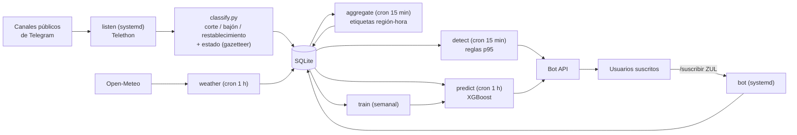

# apagon-mvp

Pipeline mínimo viable para **detectar y pronosticar fallas eléctricas (apagones y bajones) en Venezuela** usando solo fuentes de software: reportes en canales públicos de Telegram y clima de Open-Meteo. Las alertas salen por un bot de Telegram.

Corre en una sola VM pequeña (Oracle Cloud Always Free o un VPS de ~4 €/mes) con SQLite, cron y dos servicios systemd.

## Probarlo en 2 minutos (sin credenciales)

```bash
make install          # crea .venv e instala dependencias
make demo             # pipeline completo con datos sintéticos
make test             # 19 tests
```

`make demo` genera 180 días de un mundo sintético (clima por estado, sequía en Guri, racionamientos, apagones nacionales, mensajes en español venezolano), los pasa por el **mismo** clasificador y modelo que los datos reales y muestra algo así:

```
modelo           PR-AUC    Brier
persistencia      0.109    0.068
logistica         0.291    0.061
xgboost           0.291    0.061
tasa base: 0.074 · pronóstico habilitado: SÍ · umbral sugerido (máx F1): 0.148
  umbral 0.15: precisión 31% · recall 37% · alerta en 8.8% de las horas-estado

Riesgo de falla en las próximas horas (top 8):
  ZUL   71.4% ██████████████
  MER   19.5% ████
```

La demo usa `data/demo.db` y `models/demo/`; nunca toca la base real. Los números de la demo solo prueban que el pipeline funciona: **no dicen nada sobre el rendimiento con datos reales**.

## Cómo funciona



**1. Ingesta social.** `listen` escucha en tiempo real; `backfill-telegram` descarga el historial de los canales, así se puede entrenar desde el primer día. Cada mensaje se clasifica con regex (`outage`, `dip`, `restore` o nada) y se asigna a un estado buscando ciudades y municipios en el texto; si no menciona ninguno, hereda la región del canal (`config/channels.csv`). Todo mensaje se guarda, aunque no se clasifique, para poder reprocesarlo cuando mejore el clasificador.

**2. Etiquetas.** Una región-hora es "falla" si al menos `APAGON_MIN_AUTHORS` (3) **autores distintos** reportan corte o bajón, o restablecimiento. Contar autores distintos frena el spam y los reenvíos. Los restablecimientos cuentan porque durante un apagón la gente publica poco: el "llegó la luz" suele ser la señal más fuerte.

**3. Clima.** Temperatura, temperatura aparente, humedad, precipitación y ráfagas por capital de estado, más un punto en la cuenca del Caroní (Guri). La lluvia acumulada en 30 y 90 días en Guri es un proxy del estrés hidroeléctrico de fondo.

**4. Detección inmediata (reglas, sin ML).** Si los reportantes distintos de la última hora superan el p95 histórico de esa región a esa hora local, se alerta. Funciona desde el día 1.

**5. Pronóstico.** Para cada estado: P(falla en las próximas 6 h). Las features son reportes recientes (3 h, 24 h, 7 días), horas desde la última falla, fallas en el resto del país, clima actual y pronosticado, anomalía de temperatura y lluvia en Guri. `features.build_features` es la misma función para entrenar y para predecir, para que no haya diferencias entre ambos.

**6. Entrenamiento con regla de despliegue.** Split temporal (las últimas 2 semanas son prueba, con un hueco de 6 h para evitar fuga del objetivo) y early stopping temporal. Se compara contra dos baselines: persistencia y regresión logística. **Si XGBoost no supera a la persistencia en PR-AUC y Brier, el pronóstico queda deshabilitado** y el sistema solo envía alertas de detección.

## Puesta en marcha real

1. **VM**: Ubuntu en Oracle Always Free (ARM) o Hetzner CX22. Clona el repo en `/opt/apagon` y corre `sudo bash deploy/setup.sh`.
2. **Credenciales** en `.env` (parte de `.env.example`):
   - `TELEGRAM_API_ID` / `TELEGRAM_API_HASH` de [my.telegram.org](https://my.telegram.org), con una **cuenta dedicada** al proyecto. Un bot no puede leer canales donde no es admin; por eso la lectura usa una cuenta de usuario.
   - `TELEGRAM_BOT_TOKEN` de @BotFather, y `APAGON_DRY_RUN=0`.
   - `APAGON_AUTHOR_SALT`: una cadena aleatoria privada.
3. **Canales**: agrega canales/grupos públicos de reportes eléctricos en `config/channels.csv` y corre `python -m apagon init-db`.
4. **Historial**: `python -m apagon backfill-telegram --days 120` (interactivo la primera vez: pide teléfono y código) y `python -m apagon weather --backfill-days 220`. El clima necesita ~95 días más que los reportes por las ventanas de Guri.
5. **Revisa el clasificador antes de entrenar**: lee ~200 mensajes de `social_reports` y ajusta `classify.py` y `config/aliases.csv`. Es la hora más rentable de todo el proyecto.
6. `python -m apagon train` y mira las métricas.
7. `systemctl enable --now apagon-listener apagon-bot` y `crontab deploy/crontab`.

## Comandos

| Comando | Qué hace |
|---|---|
| `python -m apagon demo` | Pipeline completo con datos sintéticos |
| `init-db` | Crea tablas y sincroniza `config/` |
| `backfill-telegram --days N` | Descarga historial de los canales y recalcula etiquetas |
| `listen` | Escucha Telegram en tiempo real (servicio) |
| `weather [--backfill-days N]` | Clima reciente + pronóstico, o histórico |
| `aggregate [--full]` | Recalcula etiquetas región-hora |
| `detect` | Detección inmediata y alertas |
| `train [--test-days N]` | Entrena, compara contra baselines y guarda modelo |
| `predict [--no-alert]` | Pronóstico por estado y alertas |
| `reprocess [--all]` | Reclasifica mensajes tras cambiar el parser o el gazetteer |
| `bot` | Bot de Telegram (servicio) |
| `status` | Conteos y métricas del último modelo |

Opciones globales: `--db RUTA`, `--model-dir RUTA`, `-v`.

Comandos del bot: `/regiones`, `/suscribir ZUL [umbral]`, `/desuscribir ZUL|todas`, `/estado [ZUL]`. Sin umbral, el suscriptor usa el umbral sugerido por el modelo vigente (máximo F1 en prueba).

## Cómo leer las métricas

- **PR-AUC**: qué tan bien ordena el modelo las horas de riesgo. Compárala con la **tasa base** (lo que daría el azar) y con la **persistencia**.
- **Brier**: calidad de las probabilidades (más bajo es mejor).
- **Puntos de operación**: para cada umbral, qué fracción de alertas acierta (precisión), qué fracción de fallas se anticipa (recall) y cuántas alertas se emitirían. Úsalos para decidir el umbral, no el valor por defecto.
- **`models/latest.json`** guarda todo esto, más las features más importantes y la versión del modelo.
- **`predictions` + `region_hour`**: un JOIN por región y hora te da el rendimiento real en producción. Es tu monitoreo de drift.

## Limitaciones conocidas

- **Las etiquetas son reportes, no fallas.** El modelo predice "habrá suficientes reportes de falla", que se parece a "habrá falla" pero tiene sesgos: los estados con más conectividad y usuarios aparecen más, y los apagones largos se ven sobre todo cuando terminan.
- **Regex sin contexto**: no entiende ironía, preguntas ("¿se fue la luz en Valencia?") ni la mayoría de las negaciones. Por eso el umbral de autores distintos.
- **Geocodificación por estado**: "San Francisco", "Sucre" o "San Diego" son ambiguos; se resuelven al estado más probable.
- **Sin X/Twitter**: el tier gratuito de su API no permite lectura útil y el scraping viola sus términos.
- **Open-Meteo** es gratis para uso no comercial; si el proyecto se monetiza, necesitas su plan de pago.


## Estructura

```
apagon/
  cli.py            punto de entrada (python -m apagon …)
  config.py         settings desde .env
  db.py, schema.sql SQLite y utilidades de tiempo (UTC)
  classify.py       clasificador regex + geocodificador
  ingest/           telegram.py (Telethon), weather.py (Open-Meteo), store.py
  features.py       etiquetas región-hora y matriz de features
  model.py          entrenamiento, baselines, regla de despliegue, predicción
  alerts.py         detección por reglas y envío vía Bot API
  bot.py            comandos del bot
  demo.py           mundo sintético para pruebas
config/             regiones, alias (gazetteer), canales
deploy/             setup.sh, systemd, crontab
tests/              unitarios + punta a punta
```
